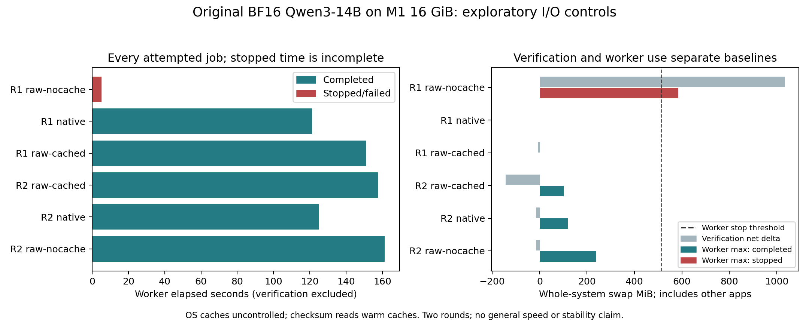
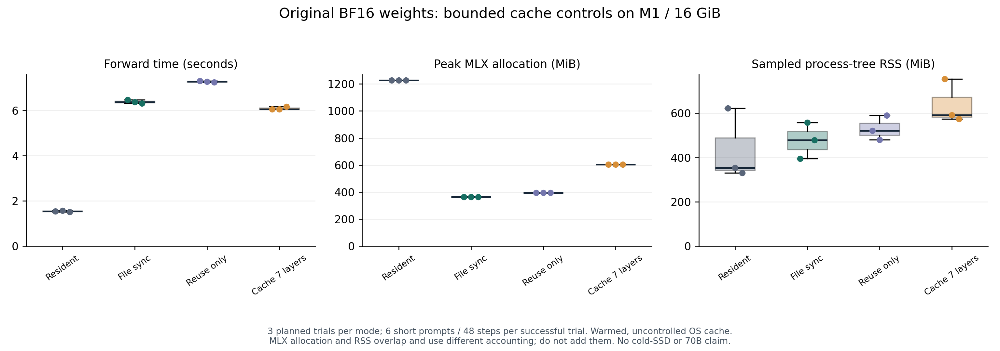

# M1 Memory Research

Author: **Megern Qaisse** ([GitHub](https://github.com/megern), [LinkedIn](https://www.linkedin.com/in/megernqaisse/)).

Local studies on an Apple M1 with 16 GiB unified memory: quantized 70B-checkpoint inference feasibility, small bilingual LoRA specialists, and a subsequent original-BF16 scheduling prototype.

The checksum-verified 70B checkpoint completed two local smoke executions. [The corrected report](results/llama70b-smoke-v2/report.json) records 164.71 seconds elapsed, first output at 131.33 seconds and 2.95 GiB sampled peak process RSS. Raw output is `Paris [end of text]`; the runtime adds its termination marker, so the original exact-whole-stdout check remains false. The first run and its duplicate-BOS warning are retained separately. A completed short smoke prompt is narrower than useful conversational speed or strong model quality. The manuscripts are editable drafts, not peer-reviewed publications.

## v0.7.0: original-weight byte read-ahead and host-memory cost

[The new working study](papers/original-read-ahead-study.txt) implements one-layer raw-byte read-ahead while keeping all MLX computation on the caller thread. Original BF16 files remain unchanged. A matched raw-serial control and the native unchunked baseline use the same 471-token question in two prospectively frozen rounds. This workload was previously examined in v0.6; it is not a held-out quality test. All [six outcomes and frozen sources](results/original-read-ahead-trials-v1/summary.json) are retained.

| Method | Completed / planned | Completed-only forward seconds | Sampled peak RSS MiB |
| --- | --- | ---: | ---: |
| native unchunked | 2/2 | 27.05 | 1090.00 |
| raw serial | 1/2 | 33.34 | 1179.73 |
| raw read-ahead | 1/2 | 25.29 | 1981.19 |

In the only completed same-round pair, read-ahead took **25.29 s versus 27.14 s** for native (**6.81% observed reduction**), but added **790.92 MiB sampled RSS**. Compared with matched raw serial, the observed reduction was 24.13%, with 801.45 MiB additional sampled RSS. Peak MLX was identical at 780.95 MiB, so that counter alone misses the host-memory cost. Each raw method stopped on swap growth in its other round; native completed both. One successful pair, uncontrolled OS caches and shared device pressure do not establish a stable or causal speedup. Native remains the default; read-ahead is opt-in and experimental.

The initial [original 0.6B numerical audit](results/raw-prefetch-numerical-v1/report.json) passed all 48 greedy and fixed-tolerance checks, with 42 exact scores and maximum absolute difference 0.0625. [Final frozen-source controls](results/raw-prefetch-numerical-summary.json) passed 48 short-prompt and six extended-prompt checks (all six extended scores exactly equal); the missing-protocol setup failure and corrected rerun are retained. These small-model audits do not verify all 14B scores. The suite now has **51 passing tests**, including actual byte-reader overlap and failure cleanup. No new training, original 70B execution or algorithmic novelty is claimed. LinkedIn publication awaits author review.

## v0.6.0: longer inputs and parallel verification on the Mac

[The new working study](papers/original-long-context-study.txt) tests **471- and 891-token prompts** with unchanged original Qwen3-14B BF16 weights. New opt-in limits allow 1024 input tokens and 2048 total context; testing these two lengths does not validate every length through those bounds. Defaults stay 128/256, one checksum worker, and the previous allocation setting. The study uses a 2048 MiB active-MLX check, GPU computation and eight CPU checksum workers. Pressure guards remain unchanged; no other applications or system settings are modified.

All [six planned larger-model attempts](results/original-long-context-trials-v1/summary.json) are retained. Four completed both `NO` answers through EOS; two stopped on whole-system swap growth above 512 MiB. [Source-verified analysis](results/original-long-context-trials-v1/analysis.json) separates complete workloads from partial results. Completed-only descriptive medians:

| Method | Completed / planned | Forward seconds | Peak MLX MiB |
| --- | --- | ---: | ---: |
| unchunked | 2/2 | 63.16 | 924.10 |
| layer-major32 | 1/2 | 95.77 | 826.24 |
| layer-major128 | 1/2 | 66.11 | 829.53 |

In the **completed same-round pair**, layer-major128 lowered peak MLX allocation by **94.56 MiB (10.2%)**, but took **4.0% longer** than whole-prompt processing. Layer-major32 saved 97.86 MiB in its completed pair but was 52.7% slower. Each chunked setting stopped in its other round, while whole-prompt processing completed both. This is an allocation/time tradeoff with failures, not a stable memory-cap guarantee or total-RAM improvement. Whole-prompt processing remains the performance reference; chunking remains experimental.

The new [setup-only checksum comparison](results/parallel-verification-trials-v1/analysis.json) completed four attempts and verified identical identities for all 15 original files. Median verification time was **24.07 s with one worker versus 8.50 s with eight**, a 64.7% observed reduction. Average process CPU use increased from about 0.74 to 2.31 logical cores, with nine recorded process threads during parallel verification. Eight configured workers do not imply eight cores remain fully occupied. Both exploratory rounds happened to run parallel before serial, with uncontrolled OS caches; this is **not a token-generation speedup or cold-cache benchmark**.

The [longer-prompt small-model audit](results/long-context-numerical-trials-v1/summary.json) passed all 18 greedy and fixed-tolerance comparisons against matching upstream BF16 references, with zero score difference. The [final default regression](results/long-context-default-regression-v1/summary.json) passed all 48 original checks. The first resident-reference swap stop and mistaken dependent-reference attempt are retained in [the failure audit](results/long-context-reference-failures-v1). The reference loader now evaluates only actual model parameters and checks baseline dependencies before GPU loading. Different chunk sizes still need not produce identical BF16 scores.

Read the [Arabic operating instructions](OPERATING_GUIDE.md) for local flags and frozen-source reproduction, and inspect [all six outcomes in the figure](figures/original-long-context-schedules.png). The local suite has **48 passing tests**, including actual concurrent hashing, corrupt-file rejection, observer cancellation/thread joining, extended cache boundaries and early dependency checks. No new model training, original-weight 70B execution or algorithmic novelty is claimed in this phase.

## Original BF16 prompt scheduling: numerical drift and layer reuse

The [2026-10-08 working study](papers/original-prefill-study.txt) adds explicit prompt chunking and a `layer-major` schedule to the original-file engine. `chunk-major` reloads every layer for each prompt chunk; `layer-major` loads a layer once, processes all prompt chunks in causal order, and then discards its weights. It retains the complete hidden sequence and original KV caches. No quantization, layer skipping, vocabulary pruning or cloud compute is introduced. The default remains whole-prompt processing (`--prefill-chunk-size 128`). Default input and total-context limits remain 128 and 256 tokens.

**Preserving original BF16 weights does not guarantee identical outputs when computation shapes change.** Chunk8 failed all 48 fixed-tolerance score comparisons with the unchunked resident reference, and changed one greedy token. Upstream MLX resident chunk8 showed the same 47/48 greedy matches and maximum absolute difference 0.4375. Upstream chunk32 likewise changed one greedy token, with 40/48 score comparisons passing. The tolerances remained `atol=0.01, rtol=0.01`. Both layer-major chunk8 and chunk32 passed all 48 comparisons against their respective upstream **chunked** references, with zero score difference: 96 matching-schedule comparisons, not proof of unchunked equivalence. [The audit manifest](results/prefill-numerical-audit.json) retains the failed control and correction of a reference-argmax/teacher-forced-token comparison error.

The [first frozen four-job study](results/original-prefill-trials-v1/analysis.json) used one 111-token security-evidence prompt with original Qwen3-14B. All four completed `NO` and EOS. Median forward time was 25.10 s unchunked versus 63.12 s chunk-major32. Peak MLX allocations did not consistently fall with chunking. The [second frozen six-job protocol](models/original-prefill-schedule-protocol.json) compares unchunked, chunk-major32 and layer-major32. It is an engineering follow-up designed after seeing the first result, using the same prompt. Sources, raw reports and every planned outcome are retained.


All six follow-up attempts completed `NO` and EOS with identical token IDs. Descriptive medians over two completed jobs per setting:

| Schedule | Completed | Forward seconds | Layer weight loads | Peak MLX MiB |
| --- | --- | ---: | ---: | ---: |
| unchunked | 2/2 | 21.68 | 80 | 688.56 |
| chunk-major32 | 2/2 | 52.13 | 200 | 686.34 |
| layer-major32 | 2/2 | 25.02 | 80 | 687.75 |

Layer-major32 reduced measured forward time by **52.0% relative to the slow chunk-major32 control**, and reduced logical layer loads from 200 to 80. It remained **15.4% slower than unchunked**, with only about 0.81 MiB lower peak MLX allocation. This is not a substantial RAM improvement or evidence of outperforming whole-prompt inference. The default therefore stays unchunked; layer-major is an experimental option for further bounded activation studies. All six attempts recorded no positive whole-system swap growth relative to their pre-verification baselines, which does not establish a hard memory cap or stability across workloads. The randomized rounds happened to repeat the same ordering, and OS caches and other apps remained uncontrolled.

[Full follow-up analysis](results/original-prefill-schedule-trials-v1/analysis.json) and [the figure](figures/original-prefill-schedules.png) retain actual measurements. Matching short output does not establish matching 14B logits or general security quality. A final-source [default regression](results/prefill-default-regression-v1/report.json) passed all 48 original resident-reference checks (42 exactly equal; maximum difference 0.0625). The v0.5.0 suite recorded 41 passing tests.

[Arabic operation and exact snapshot reproduction](OPERATING_GUIDE.md) explain the experimental options and guards. Chunked prefill and tensor reuse are established ideas; algorithmic novelty and general model quality are not established. These inference results do not report new training or original-weight 70B operation.

## Original BF16 14B: I/O controls and setup protection

A [subsequent frozen I/O protocol](models/original-io-protocol.json) ran three methods in two randomized rounds on three new short cases: arithmetic, an authentication-evidence question and Arabic geography. [All six attempted jobs](results/original-io-trials-v1/summary.json) are retained. Five completed, generating `378`, `NO` and `باريس.` through EOS. The failed first direct-nocache job stopped on global swap growth before any token completed. [The descriptive analysis](results/original-io-trials-v1/descriptive-analysis.json) verifies snapshot hashes and compares completed jobs with the same-round native control.

| Read path | Completed / planned | Completed-only median forward seconds | Comparison with same-round native |
|---|---:|---:|---|
| Native MLX lazy loading | 2 / 2 | 120.45 | Baseline |
| Direct original BF16, cached reads | 2 / 2 | 151.81 | Slower in both rounds; identical token sequences |
| Direct original BF16, descriptor F_NOCACHE | 1 / 2 | 158.60 | One comparable completion, slower; identical token sequences |

The last median contains only one completed observation. Stopped durations are never ranked as completed speed measurements. Two rounds and uncontrolled caches/other apps do not establish causality or general stability. **The alternative readers did not establish a speed improvement; native loading remains the default.** Both alternative paths separately passed 48 small-model numerical comparisons each, retaining maximum prompt-prefill difference 0.0625 and matching all greedy tokens. Those checks do not establish full-logit equivalence on 14B.



The failed job's preceding checksum pass recorded **1034.75 MiB net whole-system swap growth**, outside the old worker guard; its worker then observed another baseline-relative maximum of 584.375 MiB. These phases use different baselines and reflect all apps, so they are not a causal model-memory estimate. This observation prompted a concrete safety improvement: **the current runner guards verification too and retains its original swap baseline through inference**. A verification stop writes `model_started=false` and never launches the model. An optional `--verification-nocache` applies the documented macOS hint only to hashing descriptors. No machine-wide cache changes occur, and policy acceptance does not prove physical SSD traffic or absent cached pages. A hard 1 GiB total-RAM bound remains unproven.

A separate [first coding control](results/original-14b-code-v1/summary.json) used the new setup guard and produced the raw answer `` `items[::-1]` `` through EOS in 83.43 worker seconds plus 25.42 seconds verification. The raw text fails strict Python-expression parsing because of the Markdown code span. Removing only that complete outer span in an explicitly post-hoc display normalization yields the expected reverse-slice AST. Generated code was **inspected, never executed**. Observed peak MLX was 0.669 GiB and maximum whole-system swap growth over setup and worker samples was 22.94 MiB. This different one-question control is not a paired memory comparison with the I/O study or a general coding benchmark.

Read the [working research manuscript](papers/original-io-study.txt), retained protocols, source snapshots and [Arabic operating guide](OPERATING_GUIDE.md). The I/O release recorded 30 passing tests; v0.5.0 recorded 41; the current suite has 48. Exact reproduction of the historical six-job study uses its frozen source snapshot; the current runner has stricter setup guards. Original-weight 70B and large-model training remain outside these results.

## Direct original-file engine: original BF16 14B beyond physical RAM

The new [direct engine](tools/direct_original_engine.py) reads the pinned original safetensors files without creating duplicate layer files. It loads one original BF16 layer at a time through MLX lazy loading, gathers only requested embedding rows, and computes **every vocabulary score** in BF16 output tiles. It supports separate or shared output weights as specified by the original Qwen3 configuration. No quantization, layer skipping or vocabulary pruning is introduced. These are established techniques assembled into a local prototype; algorithmic novelty is not established.

The [first numerical control](results/direct-original-numerical-v1/summary.json) used the same six cases and reference-conditioned inputs as the earlier budgeted study, with 48 steps. All 48 greedy tokens matched; all 48 comparisons passed the preset `atol=0.01, rtol=0.01` check. **42 steps had zero maximum logit difference**, while the six prompt-prefill steps differed by at most **0.0625**. Tiling and computing only the final prompt position change kernel shapes, so this result does not establish bitwise equivalence for all inputs. The retained source snapshot identifies the exact implementation used.

This single control measured **61.26 MiB peak MLX allocation** and **275.59 MiB sampled peak process-tree RSS**, with zero observed positive system-swap growth. Its 256 MiB active-MLX budget is not a total-RAM cap. The file checksum pass warms OS caches. Acquisition of the larger model was running concurrently, so this is not a controlled speed comparison against previous trial sets. A separate [free-generation smoke run](results/direct-original-generation-v1/report.json) is retained; short generation does not establish general quality.

The larger checkpoint is [original Qwen3-14B BF16](models/qwen3-14b-original.json), pinned to revision `40c069824f4251a91eefaf281ebe4c544efd3e18`. Its eight weight files total **29,536,665,640 bytes**, exceeding this Mac's **17,179,869,184 bytes** of physical RAM. **A same-settings repeat completed both short questions locally; the first attempt stopped on global swap growth.** A [frozen first-probe protocol](models/direct-original-14b-protocol.json) records two short prompts, four tokens per case and a 1 GiB active-MLX budget. The [one-shot local continuation](tools/wait_original_probe.py) waits for verified acquisition, freezes its sources, rehashes all model files and retains the first probe including failures. It performs no automatic publication or remote inference.

The first [two-case attempt](results/direct-original-14b-first-v1/summary.json) produced `Paris` with EOS and `323` before the second EOS, then stopped at the unchanged 512 MiB system-swap-growth guard. The retained [single repeat](results/direct-original-14b-repeat-v1/summary.json) used the same frozen sources, prompts, token limits, tile size, allocation setting and guards. It completed `Paris` and `323`, both with EOS. All 40 original layers ran for each of six generated tokens (including EOS), totaling **240 layer calls**. The [header inspection](results/qwen3-14b-original-inspection.json) records 443 BF16 tensors, separate embedding/head matrices and 14,768,307,200 stored tensor elements. The [acquisition audit](results/direct-original-acquisition-audit.json) preserves the missing-chunk failure and successful resumption.

| Original 14B attempt | Full protocol completed | Worker seconds | Peak MLX GiB | Sampled peak RSS GiB | Maximum system swap growth MiB |
|---|---|---:|---:|---:|---:|
| First | No: swap-growth guard | 58.65 | Unavailable: no final worker result | 0.993 | 545.31 |
| Same-settings repeat | Yes: both cases reached EOS | 74.77 | 1.153 | 0.924 | 473.00 |

The repeat's file verification took another **17.13 seconds** outside the worker timer; the six forward steps totaled **71.53 seconds**. This is slow, short functional inference. **The 1 GiB active-allocation check setting did not impose a hard 1 GiB peak bound:** transient measured MLX allocation reached 1.153 GiB. Process RSS, active MLX, OS file caches and total unified-memory use differ; these numbers are not total system RAM. Whole-system swap growth includes other apps and file-cache pressure, so this experiment cannot uniquely attribute its source. Existing swap was present. The successful repeat follows a failed attempt and is not evidence of stable operation across workloads. No resident original-14B numerical reference was run, no broad quality benchmark was performed, and no original-weight 70B, large-model-training or algorithmic-novelty result is claimed.

See [method, observations and limitations](results/direct-original-development-notes.txt) and the [Arabic operating guide](OPERATING_GUIDE.md). The integrity and continuation tests reject altered files, inconsistent shard indexes, invalid tensor ranges, duplicate names, external file links and failed acquisitions before proceeding. Local unit suite for that release: 20 passing tests; the current suite has 30.

## Original BF16 scheduling prototype

The original, unquantized **Qwen3-0.6B BF16** checkpoint now has a pinned [download manifest](models/qwen3-0.6b-original.json), byte-preserving layer packaging, bounded CPU prefetch, and a local inference prototype with reusable computation blocks and a limited layer cache. This small model fits physical RAM; these results do **not** demonstrate original-weight 70B execution.

[The complete development notes](results/original-scheduling-development-notes.txt) and [numerical summary](results/original-scheduling-development-summary.json) retain 49 scheduled trials and 1,952 stepwise logit comparisons on identical reference inputs. All measured logits and greedy token IDs matched. Four-prompt, five-round scheduling tests found that prefetch helped the buffered-byte pipeline but lost to ordinary file loading. A later exploratory study used six additional prompts and retained both complete three-round sets, including a repeat after chart preparation finished. This is not a quality benchmark or externally preregistered study.

Repeat set, six short prompts / 48 steps per trial; three trials per mode:

| Method | Median forward seconds | Median peak MLX MiB |
|---|---:|---:|
| Fully resident | 1.5394 | 1227.66 |
| Sequential file loading | 6.3697 | 364.77 |
| Reusable block without layer cache | 7.2739 | 394.76 |
| Reusable block with seven cached layers | 6.0515 | 604.79 |

The seven-layer cache reduced median forward time by **5.00% versus sequential file loading**, using about **65.8% more MLX allocation than file loading**. It used **50.74% less peak MLX allocation than the fully resident model**, while remaining substantially slower than that resident model. These are different comparators. All three paired repeat rounds favored caching, with reductions of 6.40%, 5.00% and 2.21%; this small exploratory sample does not establish a general speedup or statistical significance.

The 640 MiB setting is an allocation heuristic with active-MLX checks, **not a total-RAM cap**. RSS is separately retained and can exceed this budget. Hash verification warms OS file caches; no cold-SSD bandwidth or physical SSD-byte claim is made. Shared embedding and KV cache remain resident. Offloading, caching and prefetch are established methods, not new inventions attributed to this project. The tied embedding/head uses the upstream architecture's shared weights; redundant serialized head data is discarded as in the resident implementation.



See [all original scheduling trials](results/original-scheduler-trials-v1/summary.json), [first follow-up](results/budgeted-engine-trials-v1/summary.json), [complete repeat](results/budgeted-engine-trials-v2/summary.json), and [retained setup failures](results/original-scheduler-failure-audit.txt). Each trial set includes a source snapshot matching its recorded hashes; restoring snapshots into a separate checkout allows reproducing earlier frozen code.

The [local CLI](tools/local_original_inference.py) generated a correct simple `add(a, b)` function through EOS in a [retained free-generation demo](results/budgeted-engine-code-demo-v1/report.json). The generated code was inspected, not executed; one function does not establish general coding quality. The prototype requires verified local files, accepts at most 128 template prompt tokens and 256 total context tokens, and bounds output to 64 tokens. It performs no automatic download or cloud inference. See [the Arabic operating guide](OPERATING_GUIDE.md) for setup and fresh-run commands.

## Completed local adaptation results

All three training seeds completed for both tasks. The same frozen 96-case test is used for each task's base and adapters. Classification permits only removal of an entire outer Markdown JSON fence; strict scores are separately retained in the raw reports.

| Synthetic task | Base accuracy | Adapter seeds 17 / 23 / 41 | Mean adapter macro-F1 |
|---|---:|---:|---:|
| Authentication rules | 33.33% | 72.92% / 72.92% / 83.33% | 0.761 |
| Workflow rules | 55.21% | 100% / 100% / 100% | 1.000 |

All adapters produced valid strict JSON for all cases; the base wrapped JSON in Markdown. Training took 180–221 seconds per adapter; peak MLX allocation was 561–609 MiB, which is not total process RAM. Each adapter weight file is 2,628,325 bytes and still requires the shared base. Seed 17 is the reference release, not the best score selected from test results.

See [the all-seed numerical summary](results/confirmatory-summary.json), [the figure](figures/specialist-accuracy.png), and [the exploratory error audit](results/exploratory-error-analysis.json). Authentication still fails on some threshold cases; its class-balanced generator has a language–label association. A language-only shortcut learned on training data scores 47/96, below all adapters but above the global majority reference. This audit was added after evaluation. Synthetic scores do not establish general Arabic or operational security competence.

The exported seed-17 adapters also completed a paired identity audit: anonymous account/source fields changed one authentication prediction (71/96 versus 70/96); an anonymous job changed no workflow prediction (96/96). These reuse the same semantic test cases and are exploratory robustness checks. The handcrafted `examples/auth.json` demo expects `high` by the stated rule but the reference 0.6B adapter actually returns `low`; this failure is retained. Both exported adapters load and run; loadability does not guarantee a correct classification.

A [later exploratory size-comparison protocol](data/size-comparison-protocol.json) uses a pinned Qwen3 1.7B 4-bit base for authentication, retaining all seeds and the same previously scored data. The base scored 39/96; adapter seeds 17/23/41 scored 73/96, 69/96 and 65/96. Their mean of 71.88% is below the 0.6B mean of 76.39%, despite greater time and memory allocation. See [all retained results](results/size-comparison-summary.json).

## 70B inference

The selected checkpoint is Llama 3.3 70B Instruct IQ2_XXS, pinned in [the manifest](models/llama70b.json). Its 19,097,390,048 bytes exceed 16 GiB of physical memory. The experiment uses existing llama.cpp CPU mmap behavior and OS paging. This first version has no custom base-layer streaming algorithm or algorithmic novelty claim.

The runtime is the official `llama-b11457-bin-macos-arm64.tar.gz` archive with SHA256 `e234070cbde0c8b0d30f79fa08ff8246abe22c72acb752619349b8d9c46f7839`. Download it from [the pinned official release](https://github.com/ggml-org/llama.cpp/releases/tag/b11457), verify that digest, and extract locally. Dependency installation and model-file retrieval require network access; every training, forward pass and evaluation in this project uses local files and local compute.

```sh
python3 -m pip install -r requirements.txt
python3 tools/install_runtime.py --output runtime
python3 tools/download_model.py --manifest models/llama70b.json --output /absolute/local/models/llama70b.gguf --workers 4
python3 tools/run_large_model.py --runtime runtime/llama-b11457/llama-completion --model /absolute/local/models/llama70b.gguf --manifest models/llama70b.json --output results/my-70b-run --timeout 900 --tokens 8
```

Use fresh output directories. The executor verifies weights before starting, disables remote inference and GPU offloading, limits context to 256, and records raw output, library timings and process-tree memory. It stops its own process group on excessive memory/swap growth or timeout. See the [readable inference manuscript](papers/inference-study.md) and [editable LaTeX source](papers/inference-study.tex) for guards, analytical bounds and limits. CPU mmap permits a virtual mapping larger than RAM; it does not imply that all weights are resident or that generation is fast.

The [memory figure](figures/inference-memory.png) uses the corrected run. The pinned GGUF [header inspection](results/llama70b-inspection.json) records 80 blocks and approximately 70.55 billion stored tensor elements. Process RSS is not model file size or total system RAM; disk-backed pages are continually reclaimed. One decoding run does not establish sustained speed. Existing system swap was present; no positive growth was observed during these measured runs.

`results/runtime-control` is an executor check using a tiny stories model. Its generated text is neither a 70B result nor a quality benchmark. Model weights and runtime binaries are excluded from this source tree.

## Small specialists

The base is [Qwen3 0.6B 4-bit at the pinned revision](https://huggingface.co/mlx-community/Qwen3-0.6B-4bit/tree/73e3e38d981303bc594367cd910ea6eb48349da8). Acquire its config, tokenizer and safetensors files locally first. Training/evaluation tools verify the base config and weight hashes before attributing results to that checkpoint. No model identifiers trigger automatic downloads.

Two task families share this base:

- `auth`: classify explicit authentication-event counts and time windows.
- `workflow`: classify explicit GitHub workflow-policy properties.

The original pilot is preserved under `data/auth`, `data/workflow` and the corresponding result files. It exposed majority collapse in the authentication adapter and a JSON-format confound in the base. A separate [confirmatory protocol](data/confirmatory-v2/protocol.json) was frozen before training: balanced labels, 384 training/48 validation/96 test cases per task, three training seeds, 400 iterations and adapters in the last 16 layers. Account/job identities and instruction surfaces are split; authentication test time values include unseen boundary conditions. Underlying rules remain shared, so these are synthetic stated-rule tasks, not broad generalization tests.

```sh
python3 tools/download_base.py --output /absolute/local/qwen3-0.6b-4bit
python3 tools/train_specialist.py --model /absolute/local/qwen3-0.6b-4bit --data data/confirmatory-v2/auth --output artifacts/auth-seed17 --iters 400 --layers 16 --seed 17
python3 tools/evaluate_specialist.py --model /absolute/local/qwen3-0.6b-4bit --data data/confirmatory-v2/auth/test.jsonl --output results/auth-base-local.json
python3 tools/evaluate_specialist.py --model /absolute/local/qwen3-0.6b-4bit --data data/confirmatory-v2/auth/test.jsonl --adapter artifacts/auth-seed17 --output results/auth-adapter-local.json
python3 -m unittest discover -s tests -v
```

Repeat with `workflow` and seeds 23/41 for the frozen confirmatory series. Use fresh outputs. The final checkpoint is scored without selecting against test accuracy. Reports retain strict schema accuracy and classification after removing only a complete outer JSON fence; arbitrary prose extraction and label repair are excluded. Macro-F1 exposes majority prediction. See [the readable specialist manuscript](papers/specialist-study.md) and [editable LaTeX source](papers/specialist-study.tex).

To run the complete original series sequentially, use `python3 tools/run_experiments.py --model /absolute/local/qwen3-0.6b-4bit --series confirmatory --output runs/fresh-reproduction`. The runner verifies all frozen split hashes before training, keeps all three seeds and writes fresh reports without overwriting the recorded study. It never downloads or executes remotely. The later comparison uses `--series size1p7` with the verified 1.7B base, obtained explicitly through `download_base.py --manifest models/qwen3-1.7b.json --output /absolute/local/qwen3-1.7b-4bit`.

Regenerate data into a fresh location with `python3 tools/make_confirmatory_data.py --output /absolute/local/fresh-data`; compare split hashes with the recorded protocol. The generator refuses to overwrite the original freeze. After every evaluation completes, run `tools/summarize_study.py --output results/fresh-summary.json` and `tools/export_adapter.py --task auth --output /absolute/local/fresh-adapter`. Export checks evaluated weight and test hashes and removes machine-specific paths from the adapter config. Repeat for `workflow`.

For exportable plots, install `requirements-figures.txt` and run `tools/plot_results.py --summary results/confirmatory-summary.json --output figures`. The saved figure displays all seeds, rather than selecting one favorable trial.

For a single local prediction, run `python3 tools/predict.py --model /absolute/local/qwen3-0.6b-4bit --adapter /absolute/local/exported-adapter --task workflow --record examples/workflow.json --language ar`. Replace the task and example for authentication. The command validates required evidence fields, uses the recorded prompt format and returns the raw output alongside its strict label. New inputs remain experimental; this interface does not guarantee correct decisions.

These are small adapters over one foundation model, not independently pretrained models. A 4 GiB MLX allocation guard is not a hard total-RAM cap. Traces, generated labels, runtime versions, data hashes and limitations accompany the study. Rule-based tools can solve these explicit rules directly; a good synthetic score does not establish production SOC, Arabic language, or security capability.

## العربية

[دليل التشغيل المحلي بالعربية](OPERATING_GUIDE.md) يشرح تنزيل الأوزان، إعادة التدريب، تجربة المحوّلات، وحدود تشغيل 70B.


ندرس إمكانية تشغيل نموذج 70B حقيقي عبر القرص على ماك M1 بذاكرة 16 GiB، ونقيس الاستجابة والذاكرة بدل الاكتفاء بتحميل الملف. وبشكل منفصل ندرب محوّلات صغيرة لمهمتين محددتين، ونقارنها بالنموذج الأصلي على حالات محجوزة بالعربية والإنجليزية. نحتفظ بنتائج التجربة الأولية والنتائج السلبية، ونفصل صحة التصنيف عن صحة التنسيق. التدريب والتقييم محليان بالكامل؛ تنزيل الملفات العامة هو خطوة الشبكة اللازمة فقط.

## Materials and licenses

Own tools and synthetic data: MIT. Base Qwen weights: Apache-2.0. Llama weights: Llama 3.3 license, not relicensed by this project's source license. Neither base is redistributed here. Paper drafts are author-review materials; no journal, institution, review status or novelty is implied.

Primary research: [LoRA](https://arxiv.org/abs/2106.09685), [QLoRA](https://arxiv.org/abs/2305.14314), [LLM in a flash](https://arxiv.org/abs/2312.11514), [FlexGen](https://arxiv.org/abs/2303.06865).

## Exploratory policy projection

The new `normalized-auth` prototype moves count/time comparisons into explicit Python code and trains the 0.6B adapter on Boolean policy facts. Data is balanced within each language. It has only eight possible states, and a direct rule baseline can solve the whole task. Sampling and wording also differ from the raw-numeric series, so any gain cannot be attributed to one change or to LLM arithmetic. Seeds 17/23/41 scored 96/96, 96/96 and 64/96: mean 88.89%, macro-F1 mean 0.852. The third seed labels every medium case high. The base scored 47/96 after outer-fence removal; direct rule code scored 96/96. All adapters produced strict JSON. Each trained in 202–203 seconds. See [the all-seed summary](results/normalized-summary.json) and [figure](figures/normalized-accuracy.png). Reproduce with `run_experiments.py --series normalized`; single predictions require `predict.py --normalize --task auth`.

## Public reference adapters

Seed 17 was specified as the reference, without best-test-score selection. Each release contains only the evaluated adapter, a portable configuration, hashes, license and model card. Shared base weights are acquired separately.

- [Authentication: raw evidence](https://huggingface.co/megern/m1-auth-rule-adapter)
- [Workflow policy](https://huggingface.co/megern/m1-workflow-rule-adapter)
- [Authentication: exploratory 1.7B](https://huggingface.co/megern/m1-auth-1p7-adapter)
- [Authentication: Python feature projection](https://huggingface.co/megern/m1-auth-normalized-adapter)
